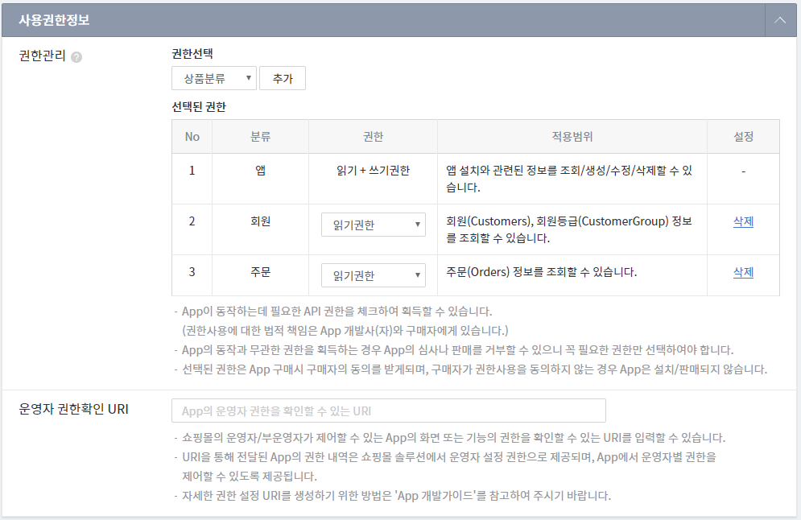

 Discount Sample
==============================

> #### 참조
>> 할인 앱 가이드 :  [discount guide](https://developer.cafe24.com/guide/front/develop?guide_no=164)\
>> cafe24 개발자 센터 : [developer.cafe24.com](https://developer.cafe24.com/)\
>> cafe24 앱 스토어 : [store.cafe24.com](https://store.cafe24.com/)

> 
>> Language : java 8 \
>> Framework : Spring boot 2.0.x \
>> 의존성 관리 : Maven 3.3.x

## 이용 방법
* 선행 조건 [개발자 센터](https://developer.cafe24.com/)에 가입후 앱을 등록한다.
    1. 기본정보 등록 ([App Guide](https://developer.cafe24.com/guide/front/intro?guide_no=47))
        
    
    2. 스코프 획득 ([Scope Guide](https://developer.cafe24.com/guide/front/develop?guide_no=58))
        
        
    3. 인증 정보 획득 ([Auth Guide](https://developer.cafe24.com/guide/front/develop?guide_no=74))
        

* 개발 환경 세팅
    1. 소스를 체크아웃 혹은 다운로드 받아서 STS, Eclipse, IntelliJ 등의 IDE에 Import 합니다.   

    2. 사용자 환경을 세팅합니다.(대괄호([] 영역 유효값으로 치환)
        * File : src\main\java\com\cafe24\app\discount\core\AppEnv.java
        ``` 
           //TODO : 운영시 정보 기입 후 사용 : App key
           public static final String CLIENT_ID = "[App key]";             //<-------------------------------- [App key] 수정
           //TODO : 운영시 정보 기입 후 사용 : App secret key
           public static final String SECRET_KEY = "[Secret key]";          //<-------------------------------- [Secret key] 수정
           //TODO : 운영시 정보 기입 후 사용 : Service key
           public static final String SERVICE_KEY = "[Service key]";       //<-------------------------------- [Service key] 수정
           //TODO : 운영시 정보 기입 후 사용 : app Url
           public static final String APP_BASE_URL = "[App host]";         //<-------------------------------- [App host] 수정
           //TODO : 운영시 정보 기입 후 사용 : app script Url
           public static final String APP_JS_URL = "[App js url]";         //<-------------------------------- [App js url] 수정
           //TODO : 운영시 정보 기입 후 사용 : app retrun Url
           public static final String APP_RETURN_URL = "[App return url]"; //<-------------------------------- [App return url] 수정
           //TODO : 운영시 정보 기입 후 사용 : app scope
           public static final String APP_SCOPE = "mall.read_application,mall.write_application,mall.read_customer,mall.read_order";
        ```
       * File : src\main\resources\static\front\app_discount.js
        ``` 
        
        ...... 상단 코드 생략 .......
        
           //TODO : 운영시 discount_url, client_id 수정
           const discount_url = "[Discount url]";//<-------------------------------- [Discount url] 수정
           const client_id = "[App key]";      //<-------------------------------- [App key] 수정

        ...... 하단 코드 생략 .......

        ```


* 배포
     1. Maven을 통해 빌드하여 tomcat 등의 WAS에 배포합니다. 
     
## 지원

cafe24 Discount Sample을 이용 중 버그를 발견하거나, 소스 코드에 대해 문의 사항이 있으면 [Issues](https://github.com/cafe24-app/app_discount_sample/issues)에 등록해 주세요.

## 업데이트 안내
* 2019.08.07
    * fornt SDK 도입 - CAFE24API.getCartItemList() : 장바구니/주문서에 담긴 상품정보
    * 제공 변수
        * quantity_based_discount : 구매수량에 비례하는 할인 금액(추가)	
        * non_quantity_based_discount : 구매수량 무관한 할인 금액(추가)
        * app_quantity_based_discount : 할인금액 (unit) - 수량에 비례(추가)
        * app_non_quantity_based_discount : 할인금액 (품주) - 수량 무관(추가)
        * basket_prd_no -> basket_product_no : 장바구니 번호(변경)
        * item_code -> variant_code : 아이템코드(변경)
        * product_qty -> quantity : 수량(변경)
        * opt_price -> option_price : 옵션추가금액(변경)
        * discount_info -> app_product_discount_info : 할인된 앱 정보(변경)
        * discount_price : EC 고객혜택 할인 적용된 금액(삭제)

                
* 2019.06.04
    * app_discount.js에 ```EC_ORDER_ORDERFORM_CHANGE``` bind 추가
    * App 삭제/만료 Webhook 처리 로직 추가
     
* 2019.01.07 
    * README 가이드 수정 
    * 응답 데이터 'product_discount'내부의 field_name 변경 : 'app_discount_info' -> 'discount_info'

* 2018.11.16 
    * README 가이드 수정 
    * HttpClient.java - Error시 응답메시지 출력
    
* 2018.10.30 
    * JS 변수 `time` 밀리초 단위에서 초 단위로 변경
        * `new Date().getTime()` -> `Math.ceil(new Date().getTime() / 1000)`
        
* 2018.10.24
    * `aBasketProductData`, `aBasketProductOrderData` 변수에 `product_qty` 항목이 추가
        * product_qty : 실제 구매 수량
        * quantity : cafe24 솔루션 할인 1+N의 적용 수량
        