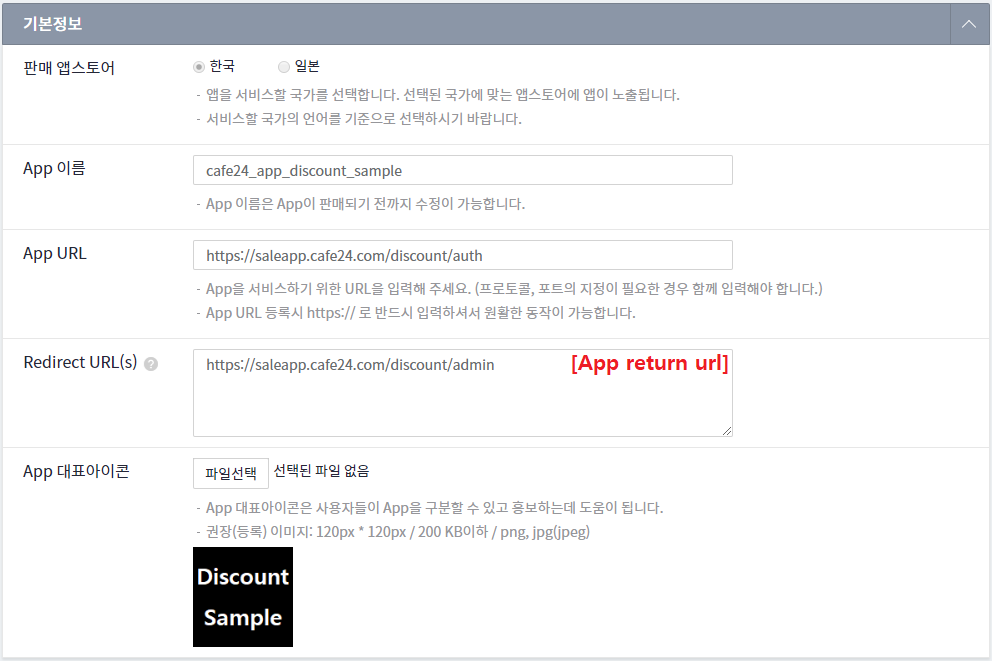
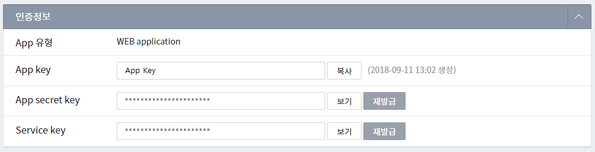

 Discount Sample
==============================

> #### 참조
>> 할인 앱 가이드 :  [discount guide](https://developer.cafe24.com/guide/front/develop?guide_no=164)\
>> cafe24 개발자 센터 : [developer.cafe24.com](https://developer.cafe24.com/)\
>> cafe24 앱 스토어 : [store.cafe24.com](https://store.cafe24.com/)

> 
>> Language : java 8 \
>> Framework : Spring boot 2.0.x \
>> 의존성 관리 : Maven 3.3.x

## 이용 방법
* 선행 조건 [개발자 센터](https://developer.cafe24.com/)에 가입후 앱을 등록한다.
    1. 기본정보 등록     
        
        
    2. 인증 정보 획득
        

* 개발 환경 세팅
    1. 소스를 체크아웃 혹은 다운로드 받아서 STS, Eclipse, IntelliJ 등의 IDE에 Import 합니다.   

    2. 사용자 환경을 세팅합니다.(대괄호([] 영역 유효값으로 치환)
        * File : src\main\java\com\cafe24\app\discount\core\AppEnv.java
        ``` 
        //App key
        public static final String CLIENT_ID = "[App key]";<-------------------------------- [App key] 수정
        //App secret key
        public static final String SECRET_KEY = "[Secre key]";<-------------------------------- [Secre key] 수정
        //Service key
        public static final String SERVICE_KEY = "[Service key]";<-------------------------------- [Service key] 수정
        //app Url
        public static final String APP_BASE_URL = "[App host]";<-------------------------------- [App host] 수정
        //app script Url
        public static final String APP_JS_URL = "[App js url]";<-------------------------------- [App js url] 수정
        //app retrun Url
        public static final String APP_RETURN_URL = "[App return url]";<-------------------------------- [App return url] 수정
        //app scope
        public static final String APP_SCOPE = "[App scope]";<-------------------------------- [App scope] 수정
        ```
       * File : src\main\resources\static\front\app_discount.js
        ``` 
        
        ...... 상단 코드 생략 .......
        
       
        //CAFE24FrontAPI 활용 기본정보 조회
        (function (CAFE24API) {
            app_discount_req_params.ec_mall_id = CAFE24API.MALL_ID;
            app_discount_req_params.shop_no = CAFE24API.SHOP_NO;
    
            // 회원정보 조회
            CAFE24API.getMemberInfo(function (res) {
                app_discount_req_params.member_id = res.id.member_id;
                app_discount_req_params.group_no = Number(res.id.group_no);
    
                if (app_discount_req_params.member_id == null) {
                    app_discount_req_params.guest_key = res.id.guest_id;
                }
    
                app_do_sale(app_discount_req_params);
            });
        })(CAFE24API.init('[App key]'));<-------------------------------- [App key] 수정

        ...... 하단 코드 생략 .......


        ```


* 배포
     1. Maven을 통해 빌드하여 tomcat 등의 WAS에 배포합니다. 
     
## 지원

cafe24 Discount Sample을 이용 중 버그를 발견하거나, 소스 코드에 대해 문의 사항이 있으면 [Issues](https://github.com/cafe24-app/app_discount_sample/issues)에 등록해 주세요.


## 업데이트 안내
* 2018.10.24 - aBasketProductData, aBasketProductOrderData 변수에 "product_qty" 항목이 추가
    * product_qty : 실제 구매 수량
    * quantity : cafe24 솔루션 할인 1+N의 적용 수량